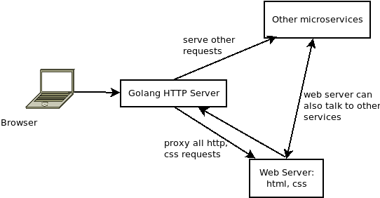

## About

This demo shows one possible way of serving a webpack+react front-end server behind a golang http service. 

## Problem

So you have built a web service using the popular React/Angular/Vue javascript frameworks and everything works perfectly with webpack and babel npms. Now as the logic becomes more and more complex, you decide to embrace the microservice infrastructure. 

[This HN discussion](https://news.ycombinator.com/item?id=13585449) lists a few options with Golang. This repo actually implements the option 2 in the discussion: **Running a Golang server that redirects all browser requests to the previous webserver that is now being treated as a microservice.**

The benefits are:

1. No toolchain changes for the web server
2. Still enjoy the hot loading during web development

The architecture now looks like this:



## Walk Through

```
go get github.com/codemk8/go-react-micro-kit
```

### Step 1: Run the web server

```bash
cd $GOROOT/src/github.com/codemk8/go-react-micro-kit/frontend
npm install
npm start
```

Above command will run the react server on <http://localhost:1235>. You can visit it directly on the browser.

### Step 2: Run the Golang main server

```bash
cd $GOROOT/src/github.com/codemk8/go-react-micro-kit
go run main.go
```

Above command will run the main server on <http://localhost:1234>. Visiting it will show the same page as in Step 1.

## The React Demo

The `/frontend` directory contains a small React TODO demo from [`Net Ninja` on youtube](https://www.youtube.com/watch?v=yZ0f1Apb5CU&list=PL4cUxeGkcC9i0_2FF-WhtRIfIJ1lXlTZR). It is a very good introduction to React. This directory actually works on more recent React versions (4.2.x).

## Production

We can keep this architecture for production. The other option is to bundle all css and html files and make the Golang server serving the bundled static file directory.

## Reference

* [JULIEN VALERY's blog about go http proxy usage](http://www.darul.io/post/2015-07-22_go-lang-simple-reverse-proxy)
    * The go main function is based on this post
